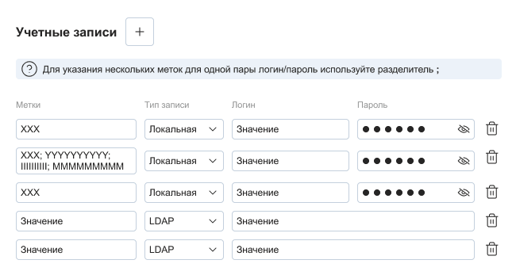
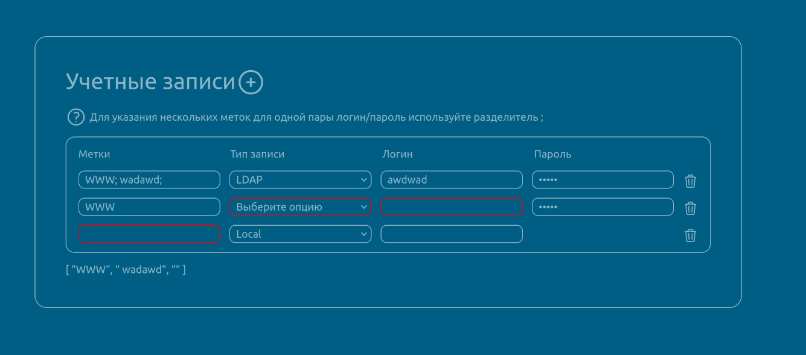

# Тестовое задание для Vue Frontend Developer

Необходимо реализовать форму управления учетными записями.
Время на выполнение задания, максимум 2 дня.
Результатом выполнения работы, является ссылка на github/gitlab репозиторий с историей коммитов.
Макет представлен для примера, главное соблюдать тз, структуру и расположение полей, визуальное отображение можно сделать по своему предпочтению.

This template should help get you started developing with Vue 3 in Vite.


Стек:
Vue.js 3 + Composition API (фреймворк)
TypeScript (язык)
Pinia (стейт менеджер)
Любой UI фреймворк на выбор.

Форма состоит из:
Заголовка и кнопки добавления учетной записи.
Подсказки для поля метка.
Списка учетных записей с лейблами полей.

Учетная запись состоит из:
1 Метка - Необязательное поле к заполнению. Максимум 50 символов. В поле вводятся текстовые метки, через знак ;
2 Тип записи - Выпадающий список. Допускаются выборы из заранее предопределенных вариантов:
- LDAP - При выборе этого типа - поле "Пароль" скрывается и сохраняется как null
- Локальная - При выборе этого типа - поле "Пароль" показывается и сохраняется как введенное значение
3 Логин - Обязательное к заполнению. Максимум 100 символов
4 Пароль - Обязательное к заполнению. Отображается в случае выбора значения "Локальная" в поле "Тип записи". Максимум 100 символов
5 Кнопки удаления учетной записи.

Логика работы формы:
1 По нажатию кнопки "+" в конец списка учетных записей, добавляется новая пустая запись, состоящая из: Метки, Типа записи, Логина, Пароля.
2 При нажатии кнопки удаления, учетная запись должна полностью удалиться.
3 По окончанию ввода значений в поля учетной записи (для текстовых - потеря фокуса, для селекта - изменение значения), происходит валидация обязательных полей. В случае валидности - учетная запись сохраняется/обновляется, в обратном, поля обозначаются красной обводкой.
4 Все поля сохраняются в текстовом виде, кроме поле Метка. Оно должно преобразовываться в массив, где один элемент это строковое значение до ;. В массиве должен лежать объект, где поле text равно одному элементу метки - ({ text: элемент метки })
5 Сохранение учетной записи должно происходить в стейт менеджер. При обновлении страницы, сохраненные учетные записи должны отображаться.

# ИТОГОВОЕ РЕШЕНИЕ !


## Recommended IDE Setup

[VSCode](https://code.visualstudio.com/) + [Volar](https://marketplace.visualstudio.com/items?itemName=Vue.volar) (and disable Vetur).

## Type Support for `.vue` Imports in TS

TypeScript cannot handle type information for `.vue` imports by default, so we replace the `tsc` CLI with `vue-tsc` for type checking. In editors, we need [Volar](https://marketplace.visualstudio.com/items?itemName=Vue.volar) to make the TypeScript language service aware of `.vue` types.

## Customize configuration

See [Vite Configuration Reference](https://vite.dev/config/).

## Project Setup

```sh
npm install
```

### Compile and Hot-Reload for Development

```sh
npm run dev
```

### Type-Check, Compile and Minify for Production

```sh
npm run build
```

### Lint with [ESLint](https://eslint.org/)

```sh
npm run lint
```
